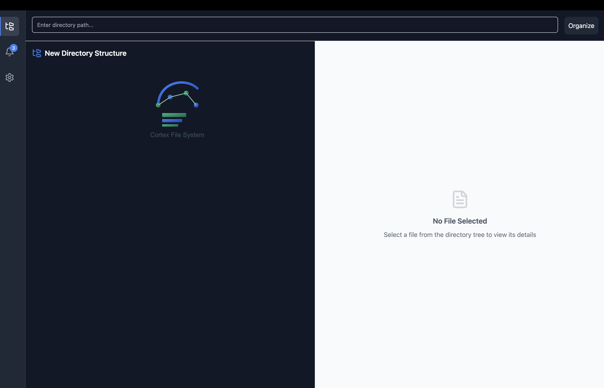

# CortexFS  

CortexFS is an intelligent file organization tool designed to simplify the way you manage your files. By leveraging Large Language Models (LLMs), CortexFS can summarize file contents and suggest the best folder to store them. It features real-time monitoring with Watch Mode and batch organization for messy directories, all while ensuring privacy by processing files locally.  

This repository is structured into two main parts: the **Backend** and the **Frontend**, each with its own repository.  

---

## Features  

- **Watch Mode**: Monitors a specified directory for newly created files and suggests appropriate locations for them.  
- **Batch Organization**: Organizes messy directories by categorizing files into meaningful folders based on their content and context.  

---

## Repository Structure  

### 1. **Backend**  
The backend is implemented using FastAPI and acts as the core of CortexFS. It handles file summarization, organization, and communication between the frontend and backend modules.  

#### Features:  
- RESTful API endpoints for file organization and Watch Mode.  
- LLM-based file summarization and classification using Langchain.  
- RabbitMQ for message-based communication and real-time notifications.  

#### Technologies:  
- **FastAPI**: Backend framework for API development.  
- **RabbitMQ**: Message broker for managing notifications and tasks.  
- **Langchain**: Library for building LLM-based agents.  

---

### 2. **Frontend**  
The frontend is built using ElectronJS, providing a simple and intuitive desktop application for users to interact with CortexFS.  

#### Features:  
- Sidebar navigation for easy access to Watch Mode, Batch Organization, and Settings.  
- Notifications for new file suggestions in Watch Mode.  
- Input fields for setting up directories and reviewing file placement suggestions.  

#### Technologies:  
- **ElectronJS**: Cross-platform desktop app development.  
- **HTML/CSS/JavaScript**: Frontend technologies for the user interface.  

## Future Enhancements
* Add semantic search capabilities for file content.
* Improve performance for batch organization with faster summarization.
* Introduce temporary file management features.

## License
This project is licensed under the MIT License.

## Contact
For any questions or feedback, please reach out to [shreyasskasetty@tamu.edu].